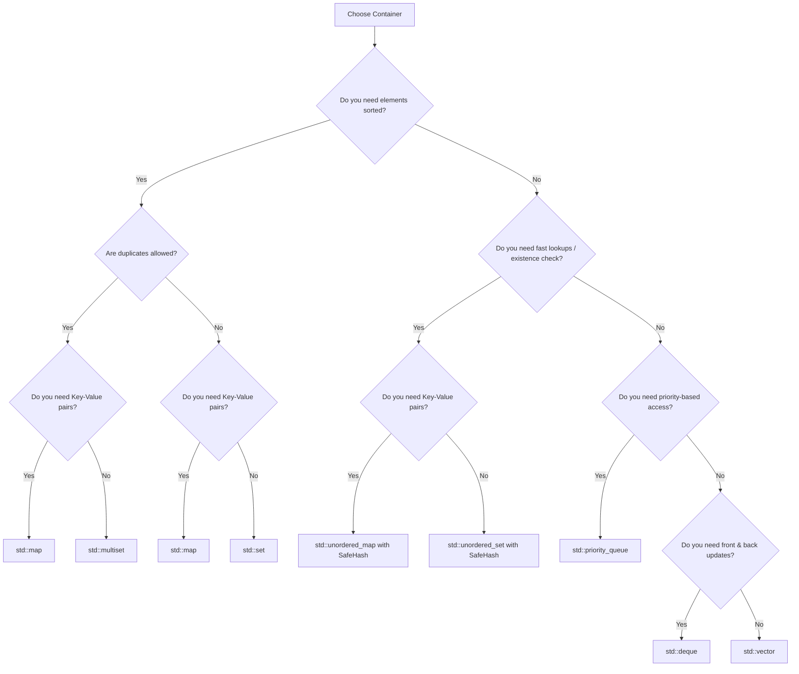

# C++ STL Containers Cheat Sheet & Decision Guide for OAs

This guide provides a comprehensive summary of C++ Standard Template Library (STL) containers, their complexities, when to use which, custom sorting, safe hash boilerplate, and crucial bug prevention in Online Assessments (OAs).

---

## 1. Complexity & Data Structure Cheat Sheet

| Container | Underlying Data Structure | Insert (Average) | Delete (Average) | Find / Search | Bound Queries (`lower_bound`) | Key Features / Notes |
| :--- | :--- | :--- | :--- | :--- | :--- | :--- |
| **`std::vector`** | Dynamic Array | $O(1)$ amortized ($O(N)$ front) | $O(1)$ back ($O(N)$ middle) | $O(N)$ ($O(\log N)$ if sorted) | $O(\log N)$ (uses global `lower_bound`) | Contiguous memory, best cache locality. |
| **`std::deque`** | Array of Fixed-size Blocks | $O(1)$ amortized (front & back) | $O(1)$ (front & back) | $O(N)$ | N/A | Double-ended. Used in Monotonic Queue & 0-1 BFS. |
| **`std::priority_queue`** | Binary Heap | $O(\log N)$ | $O(\log N)$ (pop top) | $O(1)$ (top only) | N/A | Max-heap by default. Does not support arbitrary deletion. |
| **`std::set`** | Red-Black Tree (BST) | $O(\log N)$ | $O(\log N)$ | $O(\log N)$ | $O(\log N)$ (member function) | Stores unique elements in sorted order. |
| **`std::multiset`** | Red-Black Tree (BST) | $O(\log N)$ | $O(\log N)$ | $O(\log N)$ | $O(\log N)$ (member function) | Stores duplicate elements in sorted order. |
| **`std::map`** | Red-Black Tree (BST) | $O(\log N)$ | $O(\log N)$ | $O(\log N)$ | $O(\log N)$ (member function) | Key-value pairs sorted by keys. |
| **`std::unordered_set`** | Hash Table | $O(1)$ (worst $O(N)$) | $O(1)$ (worst $O(N)$) | $O(1)$ (worst $O(N)$) | N/A | Unique elements in arbitrary order. |
| **`std::unordered_map`** | Hash Table | $O(1)$ (worst $O(N)$) | $O(1)$ (worst $O(N)$) | $O(1)$ (worst $O(N)$) | N/A | Key-value pairs in arbitrary order. |
| **`std::bitset`** | Fixed-size Bit Array | $O(1)$ | $O(1)$ | $O(1)$ | N/A | Memory-efficient ($1$ bit per flag). Fast bitwise operations. |

---

## 2. Decision Guide: "What to Use When?"

To choose the correct container, check the constraints and the queries you need to answer.



### Common OA Scenarios:
- **Top K Elements**: Use `std::priority_queue` (Min-heap of size K).
- **Coordinate Compression**: Use `std::map` (to deduplicate & sort keys) or `std::vector` + `std::unique`.
- **Sliding Window Median**: Use `std::multiset` (with iterator pointer to median element) or two heaps.
- **Sliding Window Min/Max**: Use `std::deque` (Monotonic Deque pattern).
- **Grid DFS / BFS Visited**: Use `std::unordered_set<pair<int, int>, PairHash>`.
- **Subset Sum / Knapsack Optimization**: Use `std::bitset`.

---

## 3. Custom Comparator Cheat Sheet

Comparing elements is highly important in OAs. Note that `sort` and `priority_queue` use opposite logic conventions.

### A. For `std::sort`
- **Rule**: Returns `true` if element `a` must appear **before** `b`.
```cpp
// 1. Lambda syntax (Recommended for OAs)
sort(all(v), [](const pair<int, int>& a, const pair<int, int>& b) {
    if (a.first != b.first) return a.first < b.first; // Smaller first
    return a.second > b.second;                       // Larger second on tie
});

// 2. Struct syntax
struct CustomSort {
    bool operator()(const Point& a, const Point& b) const {
        return a.x < b.x;
    }
};
sort(all(v), CustomSort());
```

### B. For `std::set` / `std::map`
- **Rule**: Returns `true` if `a` should be placed **before** `b` in the sorted order.
```cpp
struct CustomSetCmp {
    bool operator()(const Point& a, const Point& b) const {
        return a.x < b.x; // Sorted ascending by x
    }
};
set<Point, CustomSetCmp> s;
map<Point, int, CustomSetCmp> mp;
```

### C. For `std::priority_queue`
- **Rule**: Returns `true` if `a` has **lower priority** than `b` (meaning `a` goes towards the bottom of the heap).
- **Trap**: It acts opposite to `std::sort`!
```cpp
struct CustomPQ {
    bool operator()(const Point& a, const Point& b) {
        return a.x > b.x; // Returns true if a > b. This places LARGER values at the bottom, making it a Min-Heap!
    }
};
priority_queue<Point, vector<Point>, CustomPQ> pq;
```

---

## 4. Reusable Safe Hash Templates (Preventing $O(N^2)$ Hacks)

Add this boilerplate to your OA template to prevent anti-hash tests:

```cpp
#include <chrono>
#include <unordered_map>
#include <unordered_set>

using namespace std;

// 1. Safe Hash for integers
struct SafeHash {
    static uint64_t splitmix64(uint64_t x) {
        x += 0x9e3779b97f4a7c15;
        x = (x ^ (x >> 30)) * 0xbf58476d1ce4e5b9;
        x = (x ^ (x >> 27)) * 0x94d049bb133111eb;
        return x ^ (x >> 31);
    }

    size_t operator()(uint64_t x) const {
        static const uint64_t FIXED_RANDOM = chrono::steady_clock::now().time_since_epoch().count();
        return splitmix64(x + FIXED_RANDOM);
    }
};

// Use as:
// unordered_map<int, int, SafeHash> umap;
// unordered_set<int, SafeHash> uset;

// 2. Safe Hash for pairs (e.g., coordinates)
struct PairHash {
    template <class T1, class T2>
    size_t operator()(const pair<T1, T2>& p) const {
        static const uint64_t FIXED_RANDOM = chrono::steady_clock::now().time_since_epoch().count();
        uint64_t h1 = SafeHash::splitmix64(p.first + FIXED_RANDOM);
        uint64_t h2 = SafeHash::splitmix64(p.second + FIXED_RANDOM);
        return h1 ^ (h2 + 0x9e3779b9 + (h1 << 6) + (h1 >> 2));
    }
};

// Use as:
// unordered_map<pair<int,int>, int, PairHash> grid_map;
// unordered_set<pair<int,int>, PairHash> grid_visited;
```

---

## 5. Top 5 OA Pitfalls & Common Bugs

### 1. The `multiset::erase` Duplicate Wipeout
- **Bug**: Calling `ms.erase(val)` removes **all** copies of `val`.
- **Fix**: To erase a single copy, use `ms.erase(ms.find(val))`. Make sure the value exists first!
```cpp
multiset<int> ms = {2, 2, 2};
ms.erase(2);               // ms is now empty!
// To remove one 2:
auto it = ms.find(2);
if (it != ms.end()) ms.erase(it); // ms is now {2, 2}
```

### 2. Member `lower_bound` vs. Global `lower_bound`
- **Bug**: Using `std::lower_bound(s.begin(), s.end(), x)` on a `set` or `map`.
- **Consequence**: Takes $O(N)$ time, leading to TLE.
- **Fix**: Use member bounds: `s.lower_bound(x)` or `mp.lower_bound(x)` which take $O(\log N)$.

### 3. Autocreating Keys in `std::map` via operator `[]`
- **Bug**: Checking if key exists using `if (mp[key] == 0)`.
- **Consequence**: This automatically inserts the `key` with value `0` if it wasn't present, inflating map size and wasting memory/time.
- **Fix**: Use `mp.count(key)` or `mp.find(key)`.

### 4. Size Signedness Overflow
- **Bug**: Writing `for (int i = 0; i < v.size() - 1; ++i)`.
- **Consequence**: If `v` is empty, `v.size()` is `0`. Since `v.size()` is unsigned, `0 - 1` underflows to $2^{64}-1$. The loop will run infinitely or throw out-of-bounds errors.
- **Fix**: Cast to integer: `for (int i = 0; i < (int)v.size() - 1; ++i)` or check empty first.

### 5. `std::multiset::count` is Linear
- **Bug**: Calling `ms.count(x)` on a multiset to check if `x` exists.
- **Consequence**: If `x` has $K$ duplicates, `count` takes $O(\log N + K)$ time. If a test case contains $10^5$ duplicates, `count` takes $O(N)$ and causes TLE.
- **Fix**: Check existence using `ms.find(x) != ms.end()` ($O(\log N)$).
