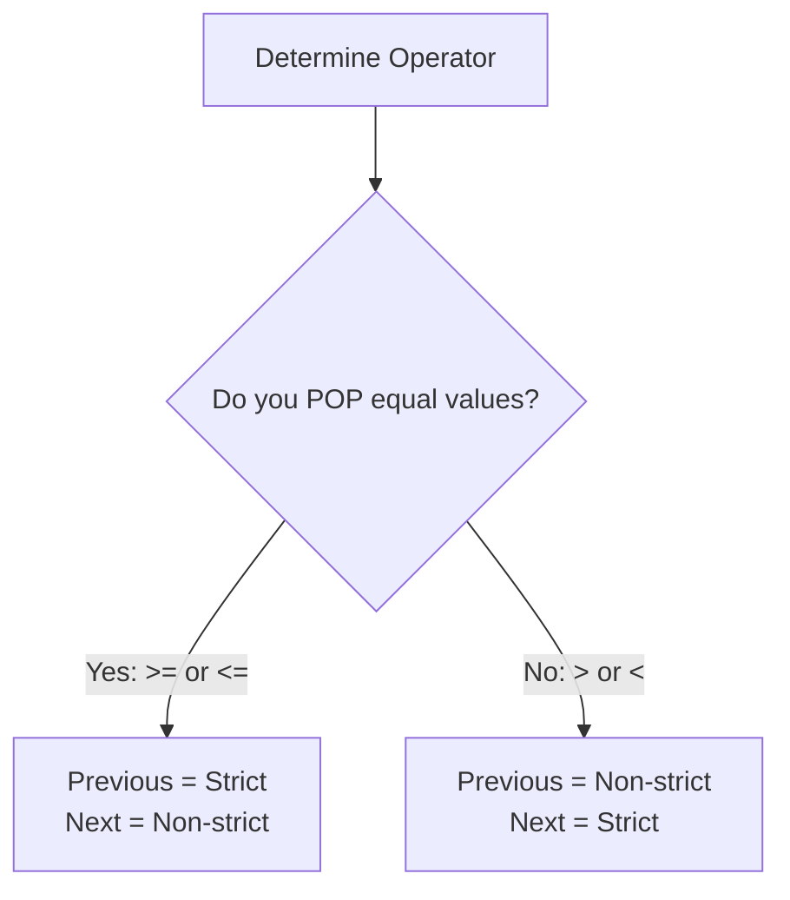

# Monotonic Stack
## Master Cheat Sheet & Decision Guide (C++)

---

## How to Use This Guide

Monotonic stacks are used to solve the "next greater/smaller element" problem in $O(N)$ time. The single-pass contribution method is particularly useful for subarray sum problems where you need to calculate the contribution of each element to all subarrays (e.g., sum of subarray minimums/maximums).

---

## Monotonic Increasing vs. Monotonic Decreasing Stack

### 📈 Monotonic Increasing Stack
* **Stack State**: Elements are sorted in **increasing** order from bottom to top (e.g., `[1, 3, 5, 8]`). We pop elements larger than or equal to the current element.
* **Core Query**: Finds the **Next / Previous Smaller** element.
* **When to Use**:
  - **Subarray Minimums**: Find the range where the current element is the minimum (e.g., *Sum of Subarray Minimums*).
  - **Boundary Limiter (Min-Height)**: Find the largest rectangle in a histogram (where the height of the rectangle is limited by the smallest bar).
  - **Stock Span / Boundaries**: Finding previous smaller elements.
* **Standard Problems**:
  - [84. Largest Rectangle in Histogram](https://leetcode.com/problems/largest-rectangle-in-histogram/)
  - [907. Sum of Subarray Minimums](https://leetcode.com/problems/sum-of-subarray-minimums/)
  - [85. Maximal Rectangle](https://leetcode.com/problems/maximal-rectangle/)

---

### 📉 Monotonic Decreasing Stack
* **Stack State**: Elements are sorted in **decreasing** order from bottom to top (e.g., `[8, 5, 3, 1]`). We pop elements smaller than or equal to the current element.
* **Core Query**: Finds the **Next / Previous Greater** element.
* **When to Use**:
  - **Subarray Maximums**: Find the range where the current element is the maximum (e.g., *Sum of Subarray Maximums*).
  - **Trapping Water (Boundary Walls)**: Water is trapped between two taller bars, so we look for greater boundaries.
  - **Next Greater Queries**: Finding when a value is exceeded (e.g., daily temperatures).
* **Standard Problems**:
  - [496. Next Greater Element I](https://leetcode.com/problems/next-greater-element-i/)
  - [503. Next Greater Element II](https://leetcode.com/problems/next-greater-element-ii/)
  - [739. Daily Temperatures](https://leetcode.com/problems/daily-temperatures/)
  - [42. Trapping Rain Water](https://leetcode.com/problems/trapping-rain-water/)
  - [2104. Sum of Subarray Ranges](https://leetcode.com/problems/sum-of-subarray-ranges/) (uses both min and max stacks)

---

## 1. Complexity & Operator Cheat Sheet

| While Condition | Equal Values | Stack after Popping | Previous Boundary | Next Boundary |
| :--- | :--- | :--- | :--- | :--- |
| `arr[stk.top()] >= arr[i]` | **Pop** | Strictly Increasing (`<`) | Previous Smaller (`<`) | Next Smaller or Equal (`<=`) |
| `arr[stk.top()] > arr[i]` | **Keep** | Non-decreasing (`<=`) | Previous Smaller or Equal (`<=`) | Next Smaller (`<`) |
| `arr[stk.top()] <= arr[i]` | **Pop** | Strictly Decreasing (`>`) | Previous Greater (`>`) | Next Greater or Equal (`>=`) |
| `arr[stk.top()] < arr[i]` | **Keep** | Non-increasing (`>=`) | Previous Greater or Equal (`>=`) | Next Greater (`>`) |

---

## 2. Decision Tree & Golden Rules

```
If you POP equal values (>= or <=):
  - Previous boundary becomes Strict
  - Next boundary becomes Non-strict

If you KEEP equal values (> or <):
  - Previous boundary becomes Non-strict
  - Next boundary becomes Strict
```



### Golden Rule 1: POP Equals (`>=` or `<=`)
* **Previous boundary** becomes **Strict** (`<` or `>`)
* **Next boundary** becomes **Non-strict** (`<=` or `>=`)

#### Examples
* `arr[stk.top()] >= arr[i]` $\rightarrow$ Previous Smaller (`<`) & Next Smaller or Equal (`<=`)
* `arr[stk.top()] <= arr[i]` $\rightarrow$ Previous Greater (`>`) & Next Greater or Equal (`>=`)

### Golden Rule 2: KEEP Equals (`>` or `<`)
* **Previous boundary** becomes **Non-strict** (`<=` or `>=`)
* **Next boundary** becomes **Strict** (`<` or `>`)

#### Examples
* `arr[stk.top()] > arr[i]` $\rightarrow$ Previous Smaller or Equal (`<=`) & Next Smaller (`<`)
* `arr[stk.top()] < arr[i]` $\rightarrow$ Previous Greater or Equal (`>=`) & Next Greater (`>`)

---

## 3. The Unified Single-Pass Template

This standard template is used to find the boundaries and calculate contributions in a single pass.

```cpp
vector<int> arr; // input array
int n = arr.size();
stack<int> stk; // stores indices

for (int i = 0; i <= n; ++i) {
    // Use dummy values at the end (e.g., -1 for min-stack, INF for max-stack) to flush the stack
    int curVal = (i == n) ? -1 : arr[i]; 
    
    while (!stk.empty() && arr[stk.top()] >= curVal) { // comparison operator determines boundaries
        int j = stk.top();
        stk.pop();
        
        int left  = stk.empty() ? -1 : stk.top(); // exclusive left boundary
        int right = i;                            // exclusive right boundary
        
        long long leftChoices  = j - left;
        long long rightChoices = right - j;
        long long contribution = leftChoices * rightChoices;
        
        // Process contribution of arr[j] here
    }
    stk.push(i);
}
```

### Key Rules to Remember:
1. `left` is always an **exclusive** left boundary.
2. `right` is always an **exclusive** right boundary.
3. *Only the meaning of those boundaries changes depending on the comparison operator.*

The choices formula never changes:
$$\text{leftChoices} = j - \text{left}$$
$$\text{rightChoices} = \text{right} - j$$
$$\text{totalSubarrays} = \text{leftChoices} \times \text{rightChoices}$$

---

## 4. Tie-Breaking Rule (Duplicates)

To avoid double-counting or under-counting duplicates when calculating contribution, **exactly one side must be strict**.

### Valid Combinations for Minimums:
* $\text{PSE } (<) + \text{NSE } (\le)$  *(Recommended: standard standard logic)*
* $\text{PSE } (\le) + \text{NSE } (<)$

### Valid Combinations for Maximums:
* $\text{PGE } (>) + \text{NGE } (\ge)$
* $\text{PGE } (\ge) + \text{NGE } (>)$

> [!WARNING]
> Never use **Strict + Strict** or **Non-strict + Non-strict**. Otherwise, duplicate values are either counted twice or not counted at all.

---

## 5. OA Memory Trick & Pitfalls

### OA Memory Trick:
* **POP** $\rightarrow$ Previous gets **stricter** (e.g., `arr[stk.top()] >= arr[i]` $\rightarrow$ Previous Smaller `<`).
* **KEEP** $\rightarrow$ Previous gets **looser** (e.g., `arr[stk.top()] > arr[i]` $\rightarrow$ Previous Smaller or Equal `<=`).

```
Pop Equals  => Previous Strict, Next Non-strict
Keep Equals => Previous Non-strict, Next Strict
```

### Top 3 Monotonic Stack Pitfalls:

#### 1. Forgetting to Flush the Stack at the End
* **Bug**: Not processing elements left in the stack when the loop finishes.
* **Fix**: Run the loop up to `i <= n` and use a dummy sentinel value (e.g., `-1` for min-stack, `INF` for max-stack) to force-pop everything remaining in the stack.

#### 2. Integer Overflow on Multiplication
* **Bug**: Writing `int contribution = (j - left) * (right - j);`.
* **Consequence**: In an array of size $10^5$, `(j - left) * (right - j)` can exceed $2 \cdot 10^9$, causing overflow/wrong answers.
* **Fix**: Cast to `long long` before multiplication:
  ```cpp
  long long contribution = (long long)(j - left) * (right - j);
  ```

#### 3. Incorrect Sentinel Value
* **Bug**: Using a sentinel value that can appear in the input array.
* **Consequence**: The dummy value does not act as a true sentinel, leading to incorrect boundaries.
* **Fix**: Ensure the sentinel is strictly smaller (for min-stack) or strictly larger (for max-stack) than any possible element in `arr`.