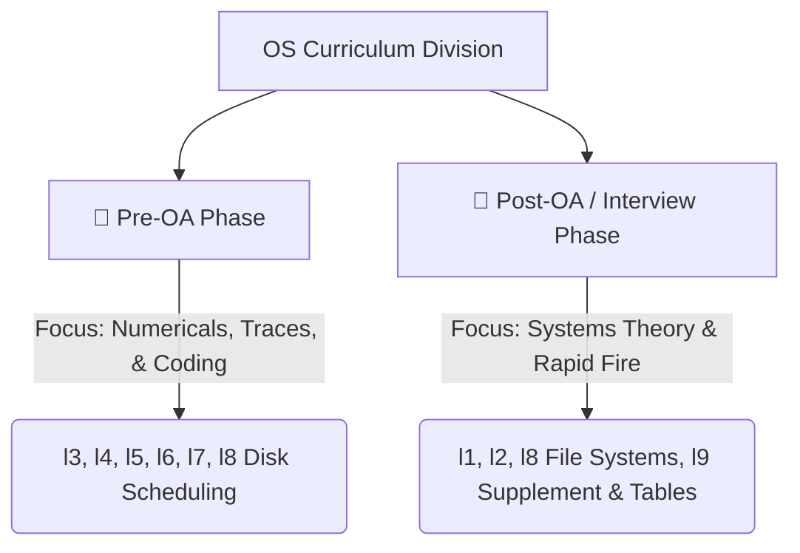

# OS Master Prep Strategy — Top Internship Interviews

> **Goal**: Crack Operating Systems (OS) rounds at top-tier software engineering firms (Google, Microsoft, Amazon, Atlassian, Adobe, DE Shaw, Uber, Goldman Sachs).
> **Aesthetic Rating**: Premium High-ROI Reference Guide.

---

## ⚡ High-Level Study Roadmap

To save you time before your Online Assessments (OAs), the curriculum is divided into **Pre-OA** (numericals, algorithm traces, and concurrency coding) and **Post-OA** (oral technical interviews, systems theory, and rapid-fire comparisons). All niche, zero-ROI hardware/implementation details have been pruned.

---

## 🎯 Phase 1: 🔴 Pre-OA Study Plan (Hands-on Coding, Numericals, & Traces)

* **Goal**: Focus only on topics that appear in Online Assessments (OAs), multiple-choice tests, and coding challenges. Read only these files first to save time.

### 1. CPU Scheduling Algorithms (numericals)
* **File to read**: [l3.md (CPU Scheduling)](file:///Users/amankashyap/Documents/internship/OS/l3.md)
* **Core Practice**:
  - Solve average Turnaround Time (TAT) and Waiting Time (WT) problems using Gantt charts.
  - Understand the preemption criteria of **SRTF** and **Round Robin** (effects of time quantum size).

### 2. Process Synchronization (concurrency coding)
* **File to read**: [l4.md (Process Synchronization)](file:///Users/amankashyap/Documents/internship/OS/l4.md)
* **Core Practice**:
  - Memorize the C++ concurrency patterns using `std::thread`, `std::mutex`, `std::unique_lock`, and `std::condition_variable`.
  - Master the semaphore-based implementation of the **Producer-Consumer**, **Readers-Writers**, and **Dining Philosophers** problems.

### 3. Deadlocks & Banker's Algorithm (math)
* **File to read**: [l5.md (Deadlocks)](file:///Users/amankashyap/Documents/internship/OS/l5.md)
* **Core Practice**:
  - Perform step-by-step Banker's Safety Algorithm calculations to check if a system is in a safe/unsafe state.

### 4. Memory Management & Paging (size & access math)
* **File to read**: [l6.md (Memory Management)](file:///Users/amankashyap/Documents/internship/OS/l6.md)
* **Core Practice**:
  - Calculate **Page Table Size**: $\text{Number of Pages} \times \text{PTE size}$.
  - Calculate **Effective Access Time (EAT)** with TLB: 
    $$\text{EAT} = h \times (t_{\text{tlb}} + t_{\text{mem}}) + (1-h) \times (t_{\text{tlb}} + t_{\text{page\_table}} + t_{\text{mem}})$$

### 5. Virtual Memory & Page Faults (replacement traces)
* **File to read**: [l7.md (Virtual Memory)](file:///Users/amankashyap/Documents/internship/OS/l7.md)
* **Core Practice**:
  - Trace page replacement strings for **FIFO, LRU, and OPT** algorithms.
  - Understand **Belady's Anomaly** (only affects FIFO).

### 6. Disk Scheduling Algorithms (seek distance calculations)
* **File to read**: [l8.md (File Systems & Disk Scheduling)](file:///Users/amankashyap/Documents/internship/OS/l8.md) Section 11
* **Core Practice**:
  - Calculate total head movement (tracks) for **SSTF, SCAN, C-SCAN, and C-LOOK**.

---

## ⏱️ Phase 2: 🔵 Post-OA Study Plan (Oral Interviews & Conceptual Q&A)

* **Goal**: Prepare for structural oral rounds, systems theory explanation, trade-off questions, and rapid conceptual comparisons. Read these files only after shortlisting.

### 1. OS Master Cheatsheet (Quick Revision)
* **File to read**: [final.md (OS Master Cheatsheet)](file:///Users/amankashyap/Documents/internship/OS/final.md)
* **Core Practice**:
  - Study the **Quick Comparison Tables** and the **Confused Pairs** section at the bottom (great for tricky oral questions).
  - Skim the **Top 30 Questions** to spot-check your memory.

### 2. Side-by-Side Comparison Tables (Interview Rapid Fire)
* **File to read**: [l9.md (Supplemental OS & Rapid Fire)](file:///Users/amankashyap/Documents/internship/OS/l9.md)
* **Core Practice**:
  - Review the **20 side-by-side comparison tables** in Section 2 (Process vs. Thread, Mutex vs. Semaphore, Zombie vs. Orphan, Fork vs. Exec, Trap vs. Interrupt, Monolithic vs. Microkernel, etc.).
  - Read Section 1 for quick supplementary updates on monitors, Sleeping Barber code, and physical disk structure.

### 3. Processes & Threads Theory
* **File to read**: [l2.md (Processes & Threads)](file:///Users/amankashyap/Documents/internship/OS/l2.md)
* **Core Practice**:
  - Understand Process memory layout (stack, heap, BSS, data, text), PCB/TCB contents, context switching overheads, and User-level vs. Kernel-level thread mapping models.

### 4. File System Internals
* **File to read**: [l8.md (File Systems)](file:///Users/amankashyap/Documents/internship/OS/l8.md) Sections 1–9
* **Core Practice**:
  - Study **Inodes**, directory structures, hard links vs. soft links, and journaling principles.

### 5. OS Architecture Basics
* **File to read**: [l1.md (OS Architecture)](file:///Users/amankashyap/Documents/internship/OS/l1.md)
* **Core Practice**:
  - Study system call mechanisms (user to kernel mode privilege switches via software traps) and kernel types.

---

## ❌ What to Skip Entirely (Zero ROI for General SDE Internships)

Do not waste time reading these topics at any stage:
1. **GUI definitions & trivia**: Never asked.
2. **Memory Overlays**: Outdated legacy concept.
3. **Firmware Details (UEFI/BIOS, GPT/MBR partition tables)**: System engineering specific, not SDE.
4. **RTOS classifications (Hard/Soft/Firm details)**: Only for embedded hardware roles.
5. **ext4 Journaling modes (`writeback`, `ordered`, `journal`)**: Too implementation-specific.
6. **SMP (Symmetric Multiprocessing) & Asymmetric clustering**: Niche server-side hardware details.
7. **Exokernels & Nanokernels**: Purely research OS topics, not commercial systems.
