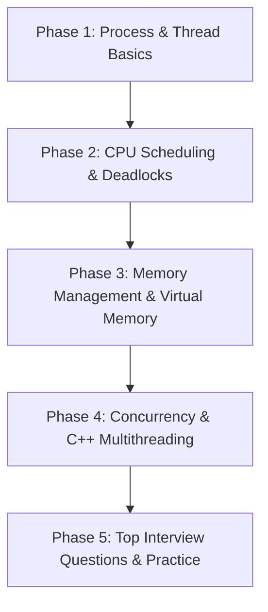

# Operating Systems (OS) Roadmap for Internship Interviews

An intensive, structured preparation guide for cracking Operating Systems questions in top-tier company interviews (e.g., Google, Microsoft, Amazon, Uber). 

---

## 📅 Roadmap Overview
OS questions in internship interviews generally focus on core concepts, synchronization, and memory management. Unlike university exams, the emphasis is heavily on **concurrency, thread safety, and how OS concepts translate to actual software design**.

---

## 🛠️ Phase-by-Phase Plan

### 🔵 Phase 1: Processes and Threads (Week 1)
*Understand the core units of execution.*

- **Process vs. Thread**: 
  - Definitions, differences, and memory layouts (stack vs. heap sharing).
  - Why are threads called lightweight processes (LWPs)?
- **Process State Transition Diagram**: Active, Ready, Blocked/Waiting, Terminated.
- **Context Switching**:
  - What happens during context switching? (Register saving, PCB/TCB updates).
  - Overhead of context switching in processes vs. threads.
- **Inter-Process Communication (IPC)**:
  - Shared memory, message queues, pipes (named & unnamed), sockets, and signals.
- **User-Level Threads vs. Kernel-Level Threads**: Mapping models (Many-to-One, One-to-One, Many-to-Many).

---

### 🔵 Phase 2: CPU Scheduling & Deadlocks (Week 2)
*How the CPU manages execution resources and handles resource conflicts.*

- **CPU Scheduling Algorithms**:
  - FCFS, Shortest Job First (SJF), Shortest Remaining Time First (SRTF), Round Robin (RR), Priority-based, Multi-level Queue.
  - Understand metrics: Turnaround Time, Waiting Time, Response Time.
- **Deadlocks**:
  - The **4 Coffman Conditions** (Mutual Exclusion, Hold and Wait, No Preemption, Circular Wait).
  - **Deadlock Handling Strategies**:
    - Prevention (breaking any of the 4 conditions).
    - Avoidance (Banker's Algorithm - Safe/Unsafe states).
    - Detection & Recovery.
    - Ignorance (Ostrich Algorithm).

---

### 🔵 Phase 3: Memory Management (Week 3)
*Crucial for systems-heavy interviews.*

- **Logical vs. Physical Address Space**: Translation using Memory Management Unit (MMU).
- **Fragmentation**: Internal vs. External fragmentation and solutions (Compaction, Paging).
- **Paging & Segmentation**:
  - Page Tables, Page Table Entries (PTE), Translation Lookaside Buffer (TLB) hit/miss overhead.
  - Multi-level Paging.
- **Virtual Memory**:
  - Demand Paging, Page Faults (step-by-step resolution).
- **Page Replacement Algorithms**:
  - FIFO, Optimal Page Replacement, Least Recently Used (LRU), Least Frequently Used (LFU).
  - **Belady's Anomaly** (specifically for FIFO).
- **Thrashing**: Cause (high page faults), detection, and prevention (Working-Set model).

---

### 🔴 Phase 4: Concurrency & C++ Multithreading (Week 4)
*The most frequently asked hands-on coding area in top-tier interviews.*

- **Race Conditions & Critical Section**: What they are and requirements for a valid solution (Mutual Exclusion, Progress, Bounded Waiting).
- **Synchronization Primitives**:
  - **Mutex (Mutual Exclusion)** vs. **Binary Semaphore** vs. **Counting Semaphore**.
  - Spinlocks (Busy waiting) vs. Blocking Locks.
- **Classic Concurrency Problems**:
  - Producer-Consumer (Bounded Buffer) Problem.
  - Readers-Writers Problem.
  - Dining Philosophers Problem.
- **C++ Concurrency Essentials (Hands-on)**:
  - Creating threads (`std::thread`).
  - Locking mechanisms (`std::mutex`, `std::lock_guard`, `std::unique_lock`).
  - Thread coordination (`std::condition_variable` with `.wait()` and `.notify_one()`/`.notify_all()`).
  - Thread safety: Building a simple thread-safe queue or a thread-safe LRU cache.

---

### 🔴 Phase 5: Interview Drill & Cheat Sheets (Week 5)
*Consolidating knowledge and answering behavioral/system design questions.*

- **System Calls vs. Library Calls**: How system calls work (Software Interrupts / Traps, User mode to Kernel mode transition).
- **Thrashing & Page Fault optimization** in real applications.
- **Revisiting Top 30 Frequently Asked Questions** (list below).

---

## 📝 Top OS Interview Questions to Prepare

1. **Why is a process context switch slower than a thread context switch?**
2. **What is virtual memory? How does the OS implement it?**
3. **What is the difference between a mutex and a semaphore? When would you use which?**
4. **Explain Belady’s Anomaly. Which page replacement algorithms suffer from it?**
5. **What is a Translation Lookaside Buffer (TLB)? What happens during a TLB miss?**
6. **How does the OS handle page faults?**
7. **Write a thread-safe Singleton pattern in C++.**
8. **What are the conditions for a deadlock? How can they be prevented?**
9. **Explain the difference between spooling and buffering.**
10. **What is thrashing, and how does the OS detect and prevent it?**
11. **What is the difference between hard real-time and soft real-time operating systems?**
12. **How does a pipe work under the hood?**
13. **What is the role of the Banker's Algorithm? Is it practical in modern general-purpose OS?**
14. **What is a zombie process vs. an orphan process? How are they cleaned up?**
15. **What is inverted page table? Why is it useful?**

---

## 📚 Recommended Resources

- **Books**:
  - *Operating System Concepts* by Silberschatz, Galvin, and Gagne (Standard reference).
  - *Operating Systems: Three Easy Pieces (OSTEP)* by Remzi and Andrea Arpaci-Dusseau (Highly recommended for practical systems programming context, free online).
- **Online Videos**:
  - *Gate Smashers* OS Playlist (Excellent for quick conceptual clarity on paging, scheduling, and deadlocks).
  - *Love Babbar* or *Striver* OS Sheets for placement-focused prep.
- **Interactive Tools**:
  - Write small C++ programs using `std::thread` and `std::mutex` to simulate race conditions and fixes.
