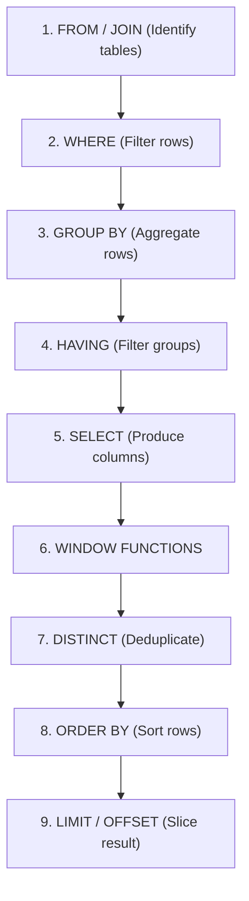

# SQL Interview Cheatsheet 

A comprehensive, production-grade guide to writing and optimizing SQL queries during technical interviews. This guide covers core execution rules, join semantics, advanced window functions, common query recipes, and high-frequency "gotchas".

---

## 1. Logical Query Execution Order 

Understanding the execution order is the single most important tool for writing correct queries. SQL is not processed in the order it is written.

### The Flow of Evaluation



### Key Interview Implications:
* **No SELECT Aliases in WHERE/GROUP BY:** You cannot use column aliases defined in the `SELECT` clause inside the `WHERE` or `GROUP BY` clauses because those steps run *before* the SELECT projection.
  *  *Incorrect:* `SELECT salary AS sal FROM Employee WHERE sal > 50000;`
  *  *Correct:* `SELECT salary AS sal FROM Employee WHERE salary > 50000;`
* **HAVING vs WHERE:** `WHERE` filters individual rows *before* aggregation. `HAVING` filters groups *after* aggregation. Never put non-aggregated filters in `HAVING`.

---

## 2. Join Semantics Cheat Sheet 

Use the right join type based on what happens to unmatched rows.

| Join Type | Behavior | Match Condition |
| :--- | :--- | :--- |
| **`INNER JOIN`** | Returns only matching rows from both tables. | Discards unmatched rows. |
| **`LEFT JOIN`** | Returns all rows from left table + matched rows from right. | Unmatched right-side columns are filled with `NULL`. |
| **`RIGHT JOIN`** | Returns all rows from right table + matched rows from left. | Unmatched left-side columns are filled with `NULL`. |
| **`FULL OUTER`** | Returns all rows from both tables. | Fills missing side with `NULL` where match is absent. |
| **`CROSS JOIN`** | Returns Cartesian Product of both tables. | No join condition; combines every row of A with every row of B. |
| **`SELF JOIN`** | Joins a table to itself (requires aliasing). | Useful for hierarchies (e.g., matching employees to managers). |

### Join Gotcha: ON vs WHERE filtering in LEFT JOIN
* Filtering in `ON` controls what gets joined. Left rows are preserved even if they fail the `ON` condition.
* Filtering in `WHERE` controls what is in the final result. It runs *after* the join, effectively turning a `LEFT JOIN` into an `INNER JOIN` if filtering on the right table.

```sql
-- Pattern A: Keeps all customers, showing orders from '2026-01-01' only if they exist
SELECT c.name, o.order_id
FROM Customer c
LEFT JOIN Orders o ON c.customer_id = o.customer_id AND o.order_date > '2026-01-01';

-- Pattern B: Discards customers without orders from '2026-01-01' (effectively an INNER JOIN)
SELECT c.name, o.order_id
FROM Customer c
LEFT JOIN Orders o ON c.customer_id = o.customer_id
WHERE o.order_date > '2026-01-01'; -- filter forces non-null check
```

---

## 3. Window Functions 

Refer to the dedicated guide [window.md](file:///Users/amankashyap/Documents/internship/DBMS/window.md) for a comprehensive, deep-dive breakdown of Window Functions, including ranking variations, value/analytical access, running aggregates, frame specifications (`ROWS` vs `RANGE`), and advanced interview recipes.

---

## 4. Subqueries vs CTEs (Common Table Expressions) 

Use **CTEs** over subqueries during interviews. They are significantly easier for interviewers to read, debug, and follow.

### Standard CTE Pattern
```sql
WITH DepartmentSalaries AS (
    SELECT department, AVG(salary) as avg_sal
    FROM Employee
    GROUP BY department
)
SELECT e.name, e.salary, ds.avg_sal
FROM Employee e
JOIN DepartmentSalaries ds ON e.department = ds.department
WHERE e.salary > ds.avg_sal;
```

### Recursive CTE Pattern (Hierarchies & Trees)
Perfect for employee-manager or organizational chart traversal questions.

```sql
WITH RECURSIVE ManagementChain AS (
    -- Anchor Member: Find the CEO (top of the hierarchy)
    SELECT id, name, manager_id, 1 AS lvl
    FROM Employee
    WHERE manager_id IS NULL
    
    UNION ALL
    
    -- Recursive Member: Join remaining employees to their managers in the CTE
    SELECT e.id, e.name, e.manager_id, mc.lvl + 1
    FROM Employee e
    JOIN ManagementChain mc ON e.manager_id = mc.id
)
SELECT * FROM ManagementChain ORDER BY lvl, name;
```

---

## 5. Critical Interview Recipes & Patterns 

### Recipe 1: Finding the N-th Highest Value (Salary)

**Method A: Window Functions (Robust & Recommended)**
Handles duplicate salaries cleanly using `DENSE_RANK()`.
```sql
WITH RankedSalaries AS (
    SELECT salary, DENSE_RANK() OVER (ORDER BY salary DESC) as rnk
    FROM Employee
)
SELECT DISTINCT salary 
FROM RankedSalaries 
WHERE rnk = 2; -- Change to N for N-th highest
```

**Method B: Pure Subquery (If Window Functions are disallowed)**
```sql
SELECT MAX(salary) 
FROM Employee
WHERE salary < (SELECT MAX(salary) FROM Employee); -- 2nd Highest
```

**Method C: Correlated Subquery (Generic N-th highest)**
```sql
SELECT DISTINCT e1.salary
FROM Employee e1
WHERE 2 - 1 = ( -- Change to N - 1
    SELECT COUNT(DISTINCT e2.salary) 
    FROM Employee e2 
    WHERE e2.salary > e1.salary
);
```

---

### Recipe 2: Consecutive Active Days / Gaps & Islands

Detect users who logged in on $N$ consecutive days.
* **Core Logic:** Subtract a sequence number (`ROW_NUMBER`) from the date. If dates are consecutive, the resulting "grouping date" stays constant.

```sql
WITH UniqueLogins AS (
    -- Deduplicate logins per day for each user
    SELECT DISTINCT user_id, CAST(login_date AS DATE) as login_date
    FROM Logins
),
RankedLogins AS (
    SELECT 
        user_id, 
        login_date,
        ROW_NUMBER() OVER (PARTITION BY user_id ORDER BY login_date) as rn
    FROM UniqueLogins
),
GroupedLogins AS (
    SELECT 
        user_id, 
        login_date,
        -- Subtracting 'rn' days from the current 'login_date'
        (login_date - INTERVAL '1 day' * rn) as grp_date
    FROM RankedLogins
)
SELECT 
    user_id, 
    MIN(login_date) as sequence_start, 
    MAX(login_date) as sequence_end, 
    COUNT(*) as consecutive_days
FROM GroupedLogins
GROUP BY user_id, grp_date
HAVING COUNT(*) >= 3; -- Find 3+ consecutive days
```

---

### Recipe 3: Relational Division ("All" Queries)

"Find customers who bought **all** products in the 'Furniture' category."

```sql
SELECT customer_id
FROM Orders o
JOIN OrderItem oi ON o.order_id = oi.order_id
JOIN Product p ON oi.product_id = p.product_id
WHERE p.category = 'Furniture'
GROUP BY customer_id
-- The number of distinct furniture items bought by customer must equal total furniture items
HAVING COUNT(DISTINCT oi.product_id) = (
    SELECT COUNT(*) FROM Product WHERE category = 'Furniture'
);
```

---

### Recipe 4: Deleting Duplicate Rows (Deduplication)

Keep only the duplicate row with the lowest ID (or oldest timestamp).

**Method A: Subquery (Universal support)**
```sql
DELETE FROM Employee
WHERE id NOT IN (
    SELECT MIN(id)
    FROM Employee
    GROUP BY name, department
);
```

**Method B: CTE with Window Function (PostgreSQL / SQL Server)**
```sql
WITH CTE AS (
    SELECT id, ROW_NUMBER() OVER (PARTITION BY name, department ORDER BY id) as rn
    FROM Employee
)
DELETE FROM Employee 
WHERE id IN (SELECT id FROM CTE WHERE rn > 1);
```

---

## 6. Dangerous SQL Gotchas & Tricks 

### 1. The `NOT IN` NULL Trap 
If the subquery of a `NOT IN` condition returns even a single `NULL` value, the outer query will return **0 rows**!
*  *Dangerous:* `SELECT * FROM Employee WHERE id NOT IN (SELECT manager_id FROM Employee);` (If any `manager_id` is NULL, this fails).
*  *Fix A (NOT EXISTS):*
  ```sql
  SELECT * FROM Employee e
  WHERE NOT EXISTS (
      SELECT 1 FROM Employee m WHERE m.manager_id = e.id
  );
  ```
*  *Fix B (Explicit Filter):*
  ```sql
  SELECT * FROM Employee 
  WHERE id NOT IN (SELECT manager_id FROM Employee WHERE manager_id IS NOT NULL);
  ```

### 2. Aggregations Ignore NULLs
Aggregate functions (`SUM`, `AVG`, `MIN`, `MAX`, `COUNT(col)`) ignore `NULL` values. Only `COUNT(*)` counts rows regardless of nullability.
* If a column contains values `10, NULL, 20`, `AVG(col)` evaluates to `(10 + 20) / 2 = 15`, NOT `10`.

### 3. Divide by Zero Safeguards
Always wrap potential zero-denominators using `NULLIF`.
```sql
-- Prevents division by zero errors by returning NULL instead of crashing
SELECT total_sales / NULLIF(total_units, 0) as unit_price
FROM SalesSummary;
```

### 4. COALESCE for Defaults
Always use `COALESCE` to handle potential nulls in reporting outputs.
```sql
-- If salary is null, default to 0
SELECT name, COALESCE(salary, 0) as salary FROM Employee;
```

---

## 7. Performance & Optimization Tips for Interviews 

If the interviewer asks: *"How would you optimize this query?"* run through this checklist:

1. **Indexes:**
   * Ensure foreign keys used in `JOIN` columns are indexed.
   * Put indexes on highly filtered columns in `WHERE` clauses.
   * Consider composite (multi-column) indexes for frequent queries filter combinations.
2. **Sargability (Search Argument Able):**
   * Avoid putting functions on indexed columns in the `WHERE` clause. It breaks index usage.
   *  *Un-sargable:* `WHERE YEAR(hire_date) = 2026`
   *  *Sargable:* `WHERE hire_date >= '2026-01-01' AND hire_date <= '2026-12-31'`
3. **Avoid `SELECT *`:**
   * Select only columns you need to reduce I/O and network bandwidth.
4. **Use `EXISTS` over `IN` for large datasets:**
   * `EXISTS` terminates scanning as soon as the first match is found, whereas `IN` might evaluate the entire subquery.
5. **Window Functions vs Self-Joins:**
   * Prefer window functions (`LAG`, `LEAD`, `SUM OVER`) over self-joins, as window functions typically require a single scan of the table (`O(N log N)` sorting), whereas self-joins can perform an `O(N^2)` Cartesian comparison.

---

## 8. Set Operators: UNION, INTERSECT, EXCEPT 

Combine results from two or more `SELECT` queries. Both queries must return the same number of columns with compatible data types.

| Operator | Returns | Removes Duplicates? |
| :--- | :--- | :--- |
| **`UNION`** | All rows from both queries |  Yes (slower) |
| **`UNION ALL`** | All rows from both queries |  No (faster) |
| **`INTERSECT`** | Rows appearing in **both** queries |  Yes |
| **`EXCEPT`** / `MINUS` | Rows in first query **not** in second |  Yes |

```sql
-- Customers who placed an order OR registered after 2025 (all, with dedup)
SELECT customer_id FROM Orders
UNION
SELECT customer_id FROM Customer WHERE YEAR(registration_date) > 2025;

-- Customers who BOTH placed an order AND are Gold tier
SELECT customer_id FROM Orders
INTERSECT
SELECT customer_id FROM Customer WHERE tier = 'Gold';

-- Customers who registered but NEVER placed an order
SELECT customer_id FROM Customer
EXCEPT
SELECT customer_id FROM Orders;
```

>  **Always prefer `UNION ALL` over `UNION`** unless deduplication is explicitly needed. `UNION` adds a sort/hash pass that is O(N log N).

---

## 9. CASE WHEN — Conditional Aggregation (Pivot Pattern) 

`CASE WHEN` inside aggregate functions is the standard SQL technique to compute conditional metrics (CTR, approval rates, quarterly pivots) without subqueries.

### Syntax
```sql
SELECT 
    campaign_id,
    -- Count rows matching a condition
    COUNT(CASE WHEN event_type = 'click' THEN 1 END)      AS total_clicks,
    COUNT(CASE WHEN event_type = 'impression' THEN 1 END)  AS total_impressions,
    -- Compute a ratio (always cast numerator to FLOAT to avoid integer division)
    ROUND(
        SUM(CASE WHEN event_type = 'click' THEN 1.0 ELSE 0 END) /
        NULLIF(SUM(CASE WHEN event_type = 'impression' THEN 1.0 ELSE 0 END), 0) * 100,
    2) AS ctr_pct
FROM AdEvents
GROUP BY campaign_id;
```

### Pivot Rows → Columns
```sql
SELECT customer_id,
    SUM(CASE WHEN EXTRACT(QUARTER FROM sale_date) = 1 THEN amount ELSE 0 END) AS Q1,
    SUM(CASE WHEN EXTRACT(QUARTER FROM sale_date) = 2 THEN amount ELSE 0 END) AS Q2,
    SUM(CASE WHEN EXTRACT(QUARTER FROM sale_date) = 3 THEN amount ELSE 0 END) AS Q3,
    SUM(CASE WHEN EXTRACT(QUARTER FROM sale_date) = 4 THEN amount ELSE 0 END) AS Q4
FROM Sales
WHERE EXTRACT(YEAR FROM sale_date) = 2026
GROUP BY customer_id;
```

---

## 10. GROUP BY Extensions: ROLLUP, CUBE, GROUPING SETS 

These extensions compute multiple levels of aggregation in a single query, replacing the need for multiple `UNION ALL` blocks.

### ROLLUP — Hierarchical Subtotals
Generates subtotals from left to right and a grand total. N grouping columns → N+1 result levels.
```sql
SELECT department, job_title, SUM(salary) AS total_salary
FROM Employee
GROUP BY ROLLUP(department, job_title);
-- Produces: (dept, title) + (dept, NULL=subtotal) + (NULL, NULL=grand total)
```

### CUBE — All Combinations
Generates subtotals for **every possible combination** of grouping columns.
```sql
SELECT department, job_title, SUM(salary)
FROM Employee
GROUP BY CUBE(department, job_title);
-- Produces: (dept, title) + (dept, NULL) + (NULL, title) + (NULL, NULL)
```

### GROUPING SETS — Explicit Control
Specify exactly which combinations to compute. More efficient than CUBE when you only need specific cross-tab groupings.
```sql
SELECT department, job_title, SUM(salary)
FROM Employee
GROUP BY GROUPING SETS(
    (department, job_title),  -- detailed rows
    (department),              -- department subtotal
    ()                         -- grand total
);
```

>  **NULL in result rows from ROLLUP/CUBE does NOT mean missing data** — it represents an aggregated group. Use `GROUPING(col)` to distinguish these from real NULLs.

---

## 11. Essential Date & String Functions 

### Date Functions (PostgreSQL syntax — most standard)

| Function | Example | Result |
| :--- | :--- | :--- |
| `DATE_TRUNC('month', col)` | `DATE_TRUNC('month', '2026-06-28')` | `2026-06-01` |
| `EXTRACT(YEAR FROM col)` | `EXTRACT(YEAR FROM hire_date)` | `2026` |
| `AGE(date1, date2)` | `AGE(NOW(), hire_date)` | `3 years 2 months...` |
| `NOW()` / `CURRENT_DATE` | `WHERE order_date >= NOW() - INTERVAL '30 days'` | Rolling 30 days |
| `TO_CHAR(col, 'YYYY-MM')` | `TO_CHAR(sale_date, 'YYYY-MM')` | `'2026-06'` |

**MySQL variants:**
```sql
DATEDIFF(end_date, start_date)     -- days between two dates
DATE_FORMAT(col, '%Y-%m')          -- format date
TIMESTAMPDIFF(MONTH, start, end)   -- difference in months
```

### String Functions

| Function | Example | Result |
| :--- | :--- | :--- |
| `UPPER(col)` / `LOWER(col)` | `UPPER('hello')` | `'HELLO'` |
| `LENGTH(col)` | `LENGTH('sql')` | `3` |
| `TRIM(col)` | `TRIM('  sql  ')` | `'sql'` |
| `SUBSTRING(col, start, len)` | `SUBSTRING('abcdef', 2, 3)` | `'bcd'` |
| `CONCAT(a, b)` / `\|\|` | `CONCAT(first, ' ', last)` | `'John Doe'` |
| `REPLACE(col, old, new)` | `REPLACE('hello', 'l', 'r')` | `'herro'` |
| `POSITION(sub IN col)` | `POSITION('lo' IN 'hello')` | `4` |

### LIKE Pattern Matching

| Pattern | Matches |
| :--- | :--- |
| `LIKE 'A%'` | Strings starting with `A` |
| `LIKE '%son'` | Strings ending with `son` |
| `LIKE '%abc%'` | Strings containing `abc` anywhere |
| `LIKE 'A_n'` | 3-character strings starting with `A`, ending with `n` |

```sql
-- Case-insensitive search (PostgreSQL uses ILIKE)
SELECT * FROM Employee WHERE name ILIKE '%john%';
```

---

## 12. Correlated Subqueries vs IN / ANY / ALL 

### Correlated Subquery
A subquery that references a column from the **outer query**. It executes once per row of the outer query (O(N) subquery executions). Useful but can be slow on large tables.

```sql
-- Find employees earning more than the average salary in their OWN department
SELECT name, salary, department
FROM Employee e1
WHERE salary > (
    SELECT AVG(salary)
    FROM Employee e2
    WHERE e2.department = e1.department  -- ← references outer row
);
```

### ANY / ALL Operators
Compare a value against a subquery result set.
* **`ANY`**: Condition is true if it holds for **at least one** value in the subquery.
* **`ALL`**: Condition is true only if it holds for **every** value in the subquery.

```sql
-- ANY: employees earning more than at least one employee in 'Engineering'
SELECT name FROM Employee
WHERE salary > ANY (SELECT salary FROM Employee WHERE department = 'Engineering');

-- ALL: employees earning more than EVERY employee in 'Engineering'
SELECT name FROM Employee
WHERE salary > ALL (SELECT salary FROM Employee WHERE department = 'Engineering');
```

>  **`> ANY` is equivalent to `> MIN(...)`** and **`> ALL` is equivalent to `> MAX(...)`**. Prefer the aggregate form for performance — the optimizer may not convert `ANY/ALL` into index scans automatically.

---

## 13. TRUNCATE vs DELETE vs DROP 

A very common interview question that tests precision on SQL DDL vs DML distinctions.

| Feature | `DELETE` | `TRUNCATE` | `DROP` |
| :--- | :--- | :--- | :--- |
| **What it removes** | Specific rows (or all rows) | All rows | Entire table + schema |
| **WHERE clause** |  Supported |  Not supported |  Not applicable |
| **Transaction** | DML — can be rolled back | DDL — cannot be rolled back (most engines) | DDL — cannot be rolled back |
| **Triggers fired?** |  Yes (row-level triggers execute) |  No |  No |
| **Speed** | Slow on large tables (logs each row) | Very fast (deallocates pages) | Instant |
| **Auto-increment reset** |  No |  Yes (resets identity counter) |  Yes (table gone) |
| **Referential integrity** | Respects FK constraints | Respects FK constraints | Fails if FK references exist |

```sql
DELETE FROM Orders WHERE order_date < '2020-01-01';  -- Remove specific rows
TRUNCATE TABLE AuditLog;                              -- Remove all rows, keep schema
DROP TABLE TempResults;                              -- Remove table entirely
```
